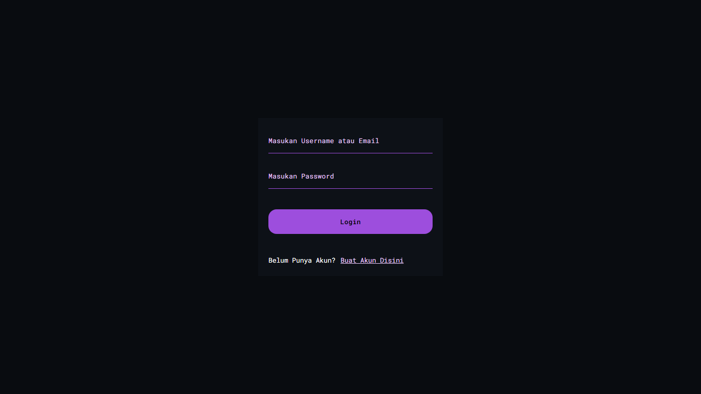
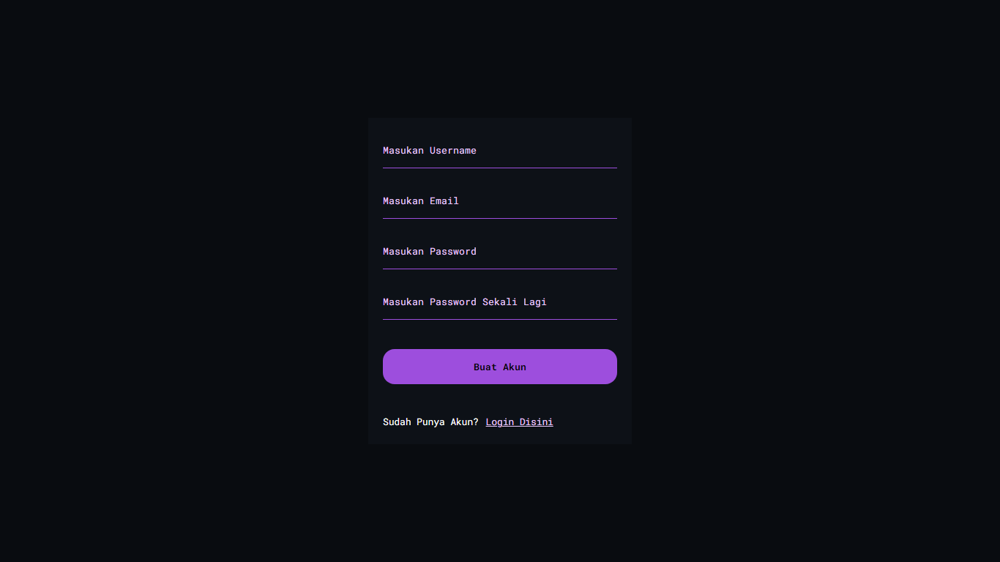
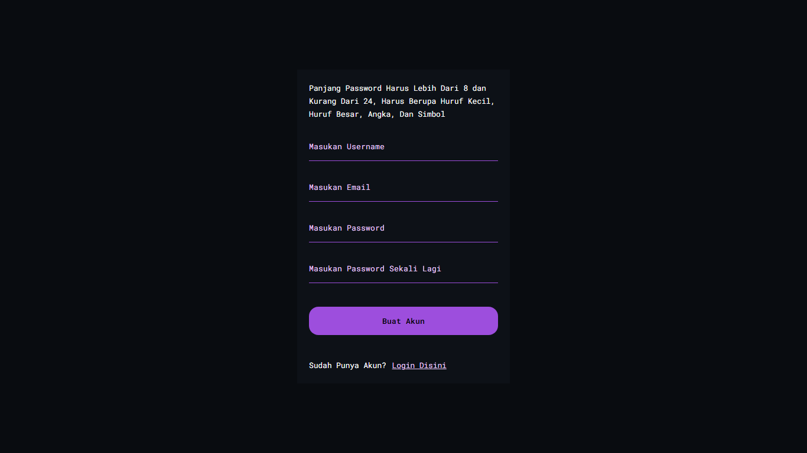

# TypeScript MongoDb Autentikasi

 

Ini adalah proyek sistem autentikasi saya yang sudah kesekian kali, diproyek ini saya membuat <u>autentikasi</u> pengguna pada lokal strategi menggunakan <u>passport</u> dan <u>passport-local</u> pada aplikasi yang dibuat dengan TypeScript dan Nodejs.
 

# Contoh Tampilan Aplikasi

# Penjelasan Singkat
Fokus dan tujuan utama dalam proyek ini adalah keamanan dan kestabilan dari sistem autentikasi aplikasi ini.
 

Package dan Teknologi yang saya gunakan :
- [TypeScript](https://www.npmjs.com/package/typescript)
- [Tslint](https://www.npmjs.com/package/tslint) (membuat file tslint.json)
- [Passport](https://www.npmjs.com/package/passport) (package utama untuk meng-handle login pengguna)
- [Passport Local](https://www.npmjs.com/package/passport-local)
- [Bcrypt](https://www.npmjs.com/package/bcryptjs) (mengenkripsi password pengguna)

# Menjalankan Aplikasi
~~~js
npm install // menginstall seluruh dependencies
npm run build // mengkonversi script ts ke js

npm start // mengkonversi script ts ke js dan menjalankan aplikasi
npm run start:dev // menjalankan aplikasi untuk tahap pengembangan
~~~
